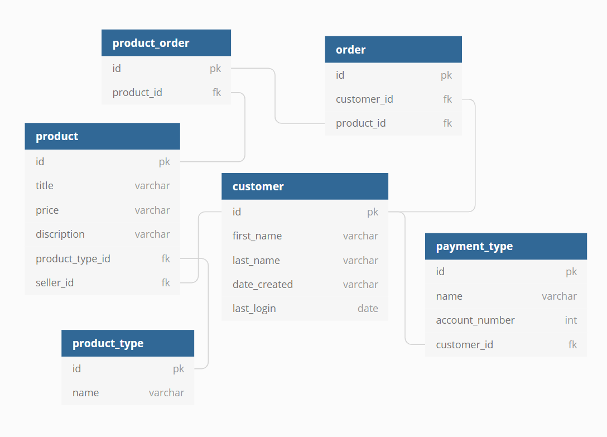
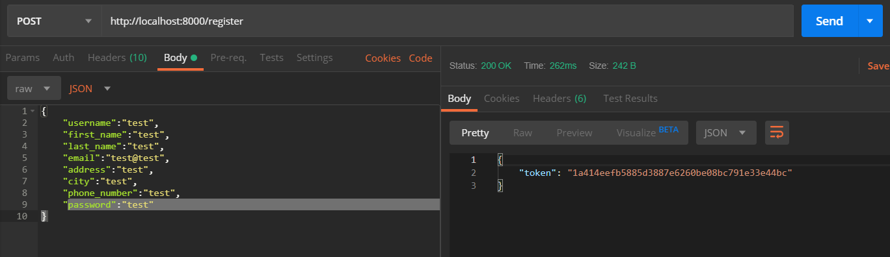
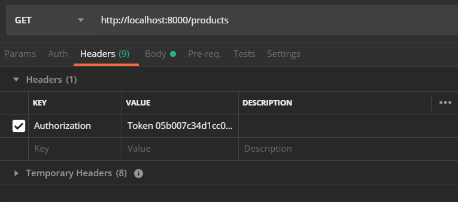

## Bangazon API

Built using Python, Django, and the Django REST Framework for serving data to the
[client-side application](https://github.com/nss-day-cohort-33/bangazon-client-application-kingdom-of-glyweth) via HTTP

Entity Relationships in the database:


# Getting Started

These instructions will get you a copy of the project up and running on your local machine for development and testing purposes.

### Requirements

* Computer
* Bash Terminal
* [Python 3](https://www.python.org/downloads/)
* [Pip](https://pip.pypa.io/en/stable/installing/)
* Text editor (Visual Studio Code)

### Installing

1. Clone down this repository and cd into it.
2. Once inside this repository, cd into `bangazon_api` and open your VSCode here with
`code .`
1. Create your virtual environment
```
python -m venv bangazonenv
```
* Start virtual environment on Mac
```
source ./bangazonenv/bin/activate
```
* Start virtual environment on Windows
```
source ./bangazonenv/Scripts/activate
```
5. Run `cd ..` You should be in a directory containing `requirements.txt`
6. Install the app's dependencies:
```
pip install -r requirements.txt
```

7. **Now cd into bangazon_api** and build your database from the existing models and populate the db with date from `fixtures/`:

## `seed_db.sh`
This is our way of managing database migrations.

* Set execute permissions
```
chmod -x seed_db.sh
```
* **CLOSE ALL CONNECTIONS TO THE DATABASE**
* Run the script
```
./seed_db.sh
```

* Fire up that server!
```
python manage.py runserver
```

# Testing in Postman

## Registration
The database requires an authorization token in the Headers to succesfully request data.
* First, generate an authorization token by making a *POST* to `/register`
* In the body of the request, copy and paste the following code so that it resembles the image below
```
{
	"username":"test",
	"first_name":"test",
	"last_name":"test",
	"email":"test@test",
	"address":"test",
	"city":"test",
	"phone_number":"test",
	"password":"test"
}
```


* After *POSTING*, a response containing a token key will be provided. Copy and paste the value of that token.

* Include a header with a key of "Authorization" with a value of "Token {paste-token-here}"



Now you may GET, POST, PUT, and DELETE to any of the following resources:
* /customer
* /payment
* /order
* /product_category
* /product
* /order_products

### Authors

* [Joe Kennerly](https://www.linkedin.com/in/joekennerly/)
* [Berkley Platte](https://www.linkedin.com/in/berkeley-platte-41855314a/)
* [Melanie Bond](https://www.linkedin.com/in/melanie-jane-007/)
* [Sydney Noh](https://www.linkedin.com/in/sydneycnoh/)
* [Misty DeRamus](https://www.linkedin.com/in/misty-deramus/)
* [Ben Parker](https://www.linkedin.com/in/benjaminpparker12/)
* [Alex Rumsey](https://www.linkedin.com/in/arumsey/)
